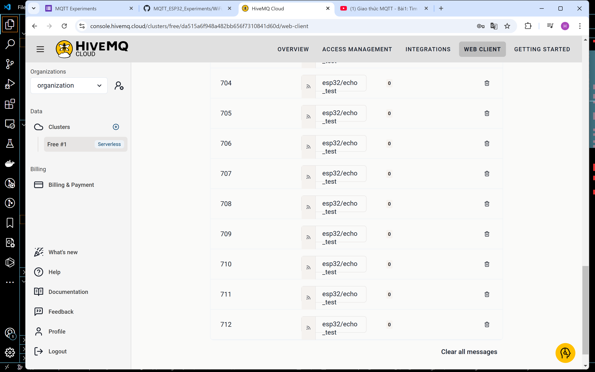

## em làm như thầy hướng dẫn và đã thành công

em đã làm được:
- Tạo tài khoản cá nhân trên HiveMQ
- Thiết lập một Broker miễn phí 
- Thiết lập bảo mật bằng username và password trên broker mới tạo
- Thiết lập kết nối mã hóa TLS từ Client dùng chứng chỉ ca_cert cung cấp bởi HiveMQ
- Fork Repo & Lặp lại thí nghiệm 2 như trong repo đã cung cấp. 

em không phải thay đổi code trong file main
em có tải ca_cert về, tạo thư mục secrets và tạo hai file là mqtt.h và wifi.h trong đó. 
sau đó nạp code là chạy được. dùng teleplot để xem. trên web thì ghi tên topic là esp32/echo_test là xem được

